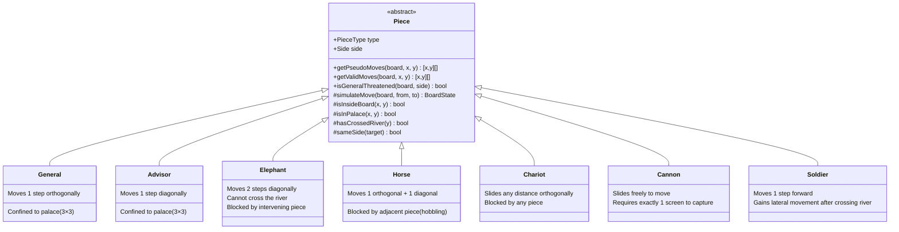

# Xiangqi (Chinese Chess)

A web/mobile implementation of Xiangqi (Chinese Chess) built with **React Native** and **Expo**.

> This project is licensed for **non-commercial use only**. See [LICENSE](./LICENSE) for details.

## Features

- Full interactive Xiangqi board (9×10 intersections)
- Turn-based logic (Red vs Black) with full rule enforcement
- Flying generals rule (将军): no move may expose your own general to check
- Valid move highlights, capture overlays, and check indicator
- Move history side panel with hover/tap board preview
- Undo & restart controls
- Global timer (starts on first move)
- Toggleable grid coordinate labels
- Piece style switcher: 文字 (text), Icon, SVG
- Adjustable board size
- Landscape orientation support

## Stack

- **React Native** + **Expo**
- **TypeScript**
- **Custom game engine** — no external chess/game libraries
- **react-native-svg** for SVG piece rendering
- **@expo/vector-icons** for icon pieces

## Development

### Prerequisites

- [Node.js](https://nodejs.org/)
- [pnpm](https://pnpm.io/)
- [Expo CLI](https://docs.expo.dev/get-started/installation/)

### Setup

```bash
pnpm install
pnpm start
```

### Tests

```bash
pnpm test
```

## Architecture

### Game engine

The engine uses a **pseudo-moves / legal-moves split** to enforce check rules without infinite recursion:

- `getPseudoMoves(board, x, y)` — raw movement for a piece, no check filtering
- `getValidMoves(board, x, y)` — base-class method: filters pseudo-moves by simulating each move and calling `isGeneralThreatened` on the resulting board
- `isGeneralThreatened(board, side)` — scans all enemy `getPseudoMoves` plus the flying-generals column check

This single filter handles all forms of check: direct attacks, discovered checks, and the flying generals rule.

### Piece class diagram



### Project structure

```
src/
├── components/
│   ├── core/          # Board, Grid, Piece renderer
│   ├── overlays/      # ValidMoves, Captures, CheckIndicator, UI chrome
│   ├── Game.tsx       # Root game layout
│   ├── GameOverlay.tsx
│   ├── GamePieces.tsx
│   └── MoveHistoryPanel.tsx
├── context/           # GameContext (wires hooks to UI)
├── hooks/
│   ├── useBoardState.ts   # Board state + move history
│   ├── useGameLogic.ts    # Turn, check detection, win condition
│   └── useOrientation.ts
├── logic/
│   ├── rules/         # Piece subclasses + PieceFactory
│   ├── board.ts       # Board init + move reconstruction
│   ├── format.ts      # Move notation formatting
│   └── types.ts
└── theme/             # ThemeContext (cellSize, displayType, colors)
```
